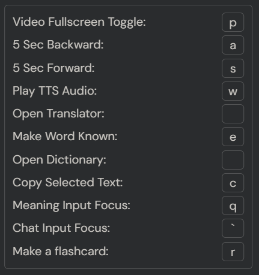

# LingQ Addon — Feature & Configuration Wiki

A comprehensive wiki and reference manual for the **LingQ Addon** userscript.

This guide is structured around the **Settings Popup** (where the majority of features and options are configured), followed by dedicated documentation for **Standalone Tools & Popups**, and complete **External Integration Guides** (Supabase DB and Anki).

---

## Table of Contents

- [Part I: Settings & Reader Experience](#part-i-settings--reader-experience)
  - [1. Reader & Display Settings](#1-reader--display-settings)
    - [1.1 Paging Mode & Reader Flow](#11-paging-mode--reader-flow)
    - [1.2 Layout Styles](#12-layout-styles)
    - [1.3 Video Orientation & Dimensions](#13-video-orientation--dimensions)
    - [1.4 Media Controller Volume Control](#14-media-controller-volume-control)
    - [1.5 Local Video Player Setup & Lesson Requirements](#15-local-video-player-setup--lesson-requirements)
    - [1.6 Typography, Sizing & Memo Widget](#16-typography-sizing--memo-widget)
    - [1.7 Color Themes & Palette](#17-color-themes--palette)
    - [1.8 Video Captions & Player Tweaks](#18-video-captions--player-tweaks)
  - [2. Keyboard Shortcuts](#2-keyboard-shortcuts)
    - [2.1 Configuration & Hotkeys Table](#21-configuration--hotkeys-table)
  - [3. AI Chat & Interactive Dictionary](#3-ai-chat--interactive-dictionary)
    - [3.1 Chat Widget Dimensions & Behavior](#31-chat-widget-dimensions--behavior)
    - [3.2 In-Reader Interactive Dictionary & Word Cards](#32-in-reader-interactive-dictionary--word-cards)
    - [3.3 Providers & Model Selection](#33-providers--model-selection)
    - [3.4 Google Vertex (GCP) Credentials](#34-google-vertex-gcp-credentials)
    - [3.5 Token Usage Log & Cost Tracking](#35-token-usage-log--cost-tracking)
    - [3.6 Quick Lesson Summary Options](#36-quick-lesson-summary-options)
  - [4. Flashcard Database Settings](#4-flashcard-database-settings)
    - [4.1 Storage Mode: Built-in vs. Custom](#41-storage-mode-built-in-vs-custom)
  - [5. AI Text-to-Speech (TTS) Settings](#5-ai-text-to-speech-tts-settings)
    - [5.1 Providers, Voices & Autoplay](#51-providers-voices--autoplay)
    - [5.2 Pronunciation Trigger Scopes](#52-pronunciation-trigger-scopes)
- [Part II: Standalone Tools & Workspaces (Wiki)](#part-ii-standalone-tools--workspaces-wiki)
  - [6. Flashcard Manager & Analytics](#6-flashcard-manager--analytics)
  - [7. TTS Playground](#7-tts-playground)
  - [8. Lesson Audio Generator (Editor Page)](#8-lesson-audio-generator-editor-page)
  - [9. Vocabulary Downloader](#9-vocabulary-downloader)
  - [10. Print a Lesson](#10-print-a-lesson)
- [Part III: Setup & Integrations](#part-iii-setup--integrations)
  - [11. Supabase Cloud Database Setup](#11-supabase-cloud-database-setup)
  - [12. Anki Integration Guide](#12-anki-integration-guide)

---

# Part I: Settings & Reader Experience

</br>

---

## 1. Reader & Display Settings

### 1.1 Paging Mode & Reader Flow
- **Use Paging Mode**: Replaces vertical page scrolling with discrete, book-like page flipping.
- **Focus on Playing Sentence**: Automatically scrolls to and centers the actively playing sentence in the reader during audio/video playback.
- **Skip End Page**: Automatically skips LingQ's lesson completion summary screen and hide clutters.
- **Finish Lesson Automatically**: Marks the lesson as complete as soon as the YouTube video track reaches the end.
- **Show Translation Automatically**: Automatically turns on the translations.
- **Auto-Dismiss Promo Banners**: Automatically detects and closes LingQ's promotional banners and marketing popups in the background.

### 1.2 Layout Styles
Customize the reader layout based on the media format of your lesson:
- **Audio Only**: Maximizes text space while keeping audio playback controls easily reachable.
- **YouTube Video**: Integrates an embedded YouTube player into the reader grid.
- **Local Video**: Replaces web players with the addon's local media player for your local video/subtitle files.
- **Layout Off**: Preserves LingQ's native reader structure while keeping the addon's fonts, colors, and side tools active.

*(Layout style is saved independently for each target language)*

### 1.3 Video Orientation & Dimensions
*(Active when Layout Style is set to YouTube Video or Local Video)*
- **Video Position**: `Right` | `Left` | `Top` | `Bottom`
- **Video Height**: Slider to adjust player height when `Top` or `Bottom` position is chosen.
- **Sentence View Video Height**: Slider for video sizing while in LingQ's Sentence Mode.
- **Autoplay in Sentence View**: Checkbox to toggle automatic playback when stepping through sentences in Sentence Mode.

### 1.4 Media Controller Volume Control

</br>

The addon enhances LingQ's native audio media controller with a dedicated volume controller button:
- **Click to Cycle Levels**: Click the volume button to cycle through preset volume levels: `0%`(Mute) → `25%` → `50%` → `75%` → `100%`.
- **Mouse Wheel Fine Adjustment**: Hover over the volume button and scroll the mouse wheel up or down to adjust volume in smooth `10%` increments.

### 1.5 Local Video Player Setup & Lesson Requirements

</br>

#### Overview & Purpose
Play your own downloaded movies, anime, or video lessons directly within LingQ, synchronizing timestamps with lesson text and routing local audio smoothly.

#### How to Use
1. Set **Layout Style** to **Local Video** in **Settings**.
2. The reader presents the **Local Video Player Setup** panel:
  - **Choose Files**: Manually select a video file (`.mp4`) and optional subtitles (`.srt`, `.vtt`).
  - **Select Folder (Auto-match)**: Select your course or media folder. The addon automatically finds and matches the video file closest to the current lesson's title.
3. Click **Start Player** (or press `Space`).
4. Click the video element to toggle play/pause in synchronization with LingQ's lesson timestamps.

#### Lesson Format Requirements on LingQ
- When importing the lesson to LingQ, import the video's subtitle file (`.srt`) with audio file (`.mp3`).
- Since the addon plays the local video's native audio, the lesson's audio file on LingQ only needs to match the total duration and can be completely silent.
- **TODO**: A simple tool (using ffmpeg) will be provided to easily convert video files to a silent audio file matching the duration.

### 1.6 Typography, Sizing & Memo Widget
- **Font Size**: Slider for lesson body text.
- **Line Height**: Slider for line spacing.
- **Google Web Font Name**: Input the name of any font from [Google Fonts](https://fonts.google.com) (e.g., `Noto Sans JP`, `Roboto Slab`, `Merriweather`). The addon loads and renders the font automatically.
- **Widget Width**: Slider to adjust the width of side widgets (Chat / Memo).
- **Show Memo Widget**: Enables a persistent notepad docked beside the reader. Notes are preserved in local storage across browser refreshes and lesson transitions.

### 1.7 Color Themes & Palette
</br>

- **Color Mode**: Switch between `White` and `Dark`. Changing this option automatically switches LingQ's native site theme to match.
- **Custom Color Pickers**:
  - **Font Color**: Base reading text color.
  - **Translation Font Color**: Color of sentence translations.
  - **LingQ Background & Border**: Color for status 1, 2, 3, and 4 vocabulary words.
  - **LingQ Border Learned**: Highlight border for learned terms.
  - **Unknown Background & Border**: Highlight styling for new/unrecognized words.
  - **Playing Underline**: Color of the highlight underline tracking the active playback sentence.

### 1.8 Video Captions & Player Tweaks
- **Video Caption Font Size**: Slider to scale video subtitles for optimal legibility.
- **Location**:
  - `Default`: Standard YouTube player subtitle position.
  - `Inside`: Repositioned inside the lower portion of the frame.
  - `Below`: Relocated underneath the video viewport so video visuals remain completely unobstructed.
- **YouTube Simplification**: The addon automatically suppresses the intrusive "More videos" overlay when pausing embedded YouTube videos.

---

## 2. Keyboard Shortcuts

</br>

### 2.1 Configuration & Hotkeys Table
Check **Enable the Keyboard Shortcuts** to activate single-key navigation without touching the mouse. Each shortcut can be customized to any single character.

| Setting Name | Default Key | Action Description |
| :--- | :---: | :--- |
| **Video Fullscreen Toggle** | `p` | Toggles fullscreen on the active video player. |
| **5 Sec Backward** | `a` | Jumps playback backward by 5 seconds. |
| **5 Sec Forward** | `s` | Jumps playback forward by 5 seconds. |
| **Play TTS Audio** | `w` | Triggers AI TTS narration for the selected word or active sentence. |
| **Open Translator** | `e` | Opens LingQ's default external translation popup. |
| **Make Word Known** | `d` | Instantly advances the selected word to "Known" status. |
| **Open Dictionary** | `f` | Opens the configured external dictionary. |
| **Copy Selected Text** | `c` | Copies selected word or phrase to the clipboard. |
| **Meaning Input Focus** | `` ` `` (Backtick) | Immediately focuses LingQ's custom meaning input box. |
| **Chat Input Focus** | `q` | Focuses the query input of the AI Chat Widget. |
| **Make a flashcard** | `r` | Creates a flashcard instantly from the selected word and AI response. |

---

## 3. AI Chat & Interactive Dictionary

</br>

### 3.1 Chat Widget Dimensions & Behavior
- **Enable the Chat Widget**: Toggles the interactive AI sidebar on or off.
- **Response Language**: Choose `Auto` or specify a target language for AI responses.
- **Chat Widget Height**: Slider to adjust docked AI chat widget height.
- **Enable asking with selected text**: When enabled, selecting text in the lesson automatically shows an AI dictionary.

### 3.2 In-Reader Interactive Dictionary & Word Cards

#### In-Place Editing (Ctrl + Click)
- Hold `Ctrl` (or `Cmd` on macOS) and click on the **Pronunciation** or **Meaning** fields in an AI dictionary card.
- Edit the text inline and press `Enter` (or click away) to save.

#### Flashcard Count Badge & History Popup
- **Count Badge**: Next to the word heading in any AI dictionary card, a badge displays the count of existing flashcards currently stored in your database for that word (e.g., `1`, `2`, ..., `9+`).
- **Word Click Popup**: Clicking on the bold word heading opens a popup listing all previously saved flashcards for that word. This enables you to review prior contexts or remove duplicate cards on the spot.

#### Response Card Actions
- **Copy**: Copies the response text to clipboard.
- **Read Aloud**: Narrates the definition and the example sentence using AI TTS.
- **Make Flashcard**: Saves the card directly to the flashcard database with automated sentence context extension.
- **Regenerate**: Re-generate the AI dictionary card.
- **Delete**: Removes the card from the chat list.

### 3.3 Providers & Model Selection
Enter your API key corresponding to your selected Chat Provider: (`gemini-3.1-flash-lite` is recommended for its low cost and nice response quality and speed.)

| Provider | Supported Models | Description |
| :--- | :--- | :--- |
| **Google** | `gemini-3.8-flash`, `gemini-3.7-flash`, `gemini-3.6-flash`, `gemini-3.5-flash`, `gemini-3.5-flash-lite`, `gemini-3.1-flash-lite`, ... | Recommended for speed and low cost. Includes explicit context caching. |
| **OpenAI** | `gpt-5.6-sol`, `gpt-5.6-terra`, `gpt-5.6-luna`, `gpt-5.5`, `gpt-5.4`, `gpt-5.4-mini` | |
| **Anthropic** | `claude-sonnet-5`, `claude-sonnet-4-6`, `claude-haiku-4-5` | |
| **DeepSeek** | `deepseek-v4-pro`, `deepseek-v4-flash` | Highly cost-effective alternative models.<br> If you live in China, use this. |
| **Cerebras** | `gemma-4-31b` | Ultra-fast inference engine. |

### 3.4 Google Vertex (GCP) Credentials
When **Vertex (GCP)** is selected as the provider:
- Fields for **Project ID**, **Client Email**, and **Private Key** appear.
- Alternatively, click **Load from JSON** to upload your Google Cloud service account key directly.

### 3.5 Token Usage Log & Cost Tracking
Click the **Usage Log** button to open the token monitoring popup:
- Displays token metrics filtered by language or across `All` languages.
- Breaks down `cached_tokens`, `input_tokens`, `reasoning_tokens`, and `output_tokens`.
- Summarizes estimated expenditure per provider and model.

### 3.6 Quick Lesson Summary Options
- **Prepend a quick Summary**: Automatically generates a concise summary at the top of each lesson before reading.
- **Summary Difficulty (CEFR)**: Calibrate the vocabulary and grammatical complexity of the summary:
  - `Unset`: Standard level. Don't care about the difficulty of the response.
  - `A1` / `A2`: Simplified grammar, accessible vocabulary, short sentences.
  - `B1` / `B2`: Intermediate natural prose.
  - `C1` / `C2`: Advanced native-level expression with idiomatic phrases.

---

## 4. Flashcard Database Settings

### 4.1 Storage Mode: Built-in vs. Custom
- **Built-in (Central DB)**:
  - Requires no cloud infrastructure setup.
  - Enter your email and click **Send OTP** to receive a sign-in code.
  - Enter the code and click **Verify** to authenticate. Flashcards synchronize with the addon's central database.
- **Custom (Personal Supabase DB)**:
  - Connect your own private [Supabase](https://supabase.com) project.
  - Enter your **DB URL** and **DB Key** (Publishable anon key), then click **Save** to verify the connection.
  - *(See [Section 10](#10-supabase-cloud-database-setup) for the complete SQL schema and setup walkthrough)*.

---

## 5. AI Text-to-Speech (TTS) Settings

### 5.1 Providers, Voices & Autoplay
- **Autoplay TTS voice**: Automatically pronounces the target word upon selection.
- **TTS API Key**: Enter your API key for the chosen voice provider.
- **TTS Provider**:
  - `OpenAI`: Expressive voices.
  - `Google Gemini`: Multimodal audio synthesis.
  - `Google Cloud`: Diverse international accents and dialect voices.
- **TTS Voice**: Select voice model or set to `Random`.

### 5.2 Pronunciation Trigger Scopes
- **Enable AI-TTS for words**: Replaces LingQ's default TTS with AI voice generation when clicking individual vocabulary words.
- **Enable AI-TTS for sentences**: Narrates entire sentences in high-fidelity AI TTS.

---

# Part II: Standalone Tools & Workspaces (Wiki)

---

## 6. Flashcard Manager & Analytics

</br>

### Overview & Purpose
A comprehensive vocabulary hub to review, search, audit, and export your flashcards.

### Features
1. **Interactive Table & Filtering**:
  - Filter cards by target language using the language dropdown.
  - Search instantly by idx, word, meaning.
2. **Export as CSV**:
  - Generates a cleanly structured CSV file formatted specifically for Anki import with HTML context highlights.
  - *(See [Section 11. Anki Integration Guide](#11-anki-integration-guide) for complete importing instructions, deck templates, and field mappings)*.
3. **Visual Learning Trends**:
  - Interactive bar chart displaying flashcard creation volume over time.
  - Switchable time horizons: **Week**, **Month**, **Year**, and **All**.
4. **AI Diagnostic Report**:
  - Click **AI Report** and select word sample size (`50`, `100`, `300`, or `500` words).
  - The AI inspects your flashcard history and produces a diagnostic report highlighting recurring grammatical challenges, common semantic categories.
  - Click **Download the Report** to save it locally.

---

## 7. TTS Playground

</br>

### Overview & Purpose
An experimental soundboard to audition AI voices, test speech emotion and prosody instructions, and generate custom audio files.

### How to Use
1. Open **TTS Playground** from the toolbar.
2. In **Style Instructions**, enter expressive directing prompts.
3. Enter or paste text in the **Text** area.
4. Click **Generate Audio**.
5. Listen using the embedded player, adjust volume and speed, or download the audio clip.

---

## 8. Lesson Audio Generator (Editor Page)

</br>

### Overview & Purpose
Generate a complete, high-quality audio track and synchronized sentence timestamps for text-only lessons.

### How to Use
1. Open any lesson in the LingQ Lesson Editor (`https://www.lingq.com/.../editor/...`).
2. Ensure your preferred TTS provider, API key, and voice are configured in the addon's **Settings** (⚙️).
3. In the editor sidebar controls, click **Generate Lesson Audio**.
4. A progress bar tracks each step in real time. Once completed, the editor page refreshes automatically with your new synchronized audio ready for study.

---

## 9. Vocabulary Downloader

</br>

### Overview & Purpose
Direct bulk export of LingQ vocabulary data into CSV spreadsheets with real-time API progress tracking.

---

## 10. Print a Lesson

</br>

### Overview & Purpose
Formats the current lesson into clean, printer-friendly study handouts.
- Retains word status highlights and color coding.
- Automatically appends a comprehensive **Vocabulary Glossary Table** at the end of the lesson.
- Open via reader options and trigger your browser's print dialog (`Ctrl + P` / `Cmd + P`) to print or save to PDF.

---

# Part III: Setup & Integrations

---

## 11. Supabase Cloud Database Setup

To store flashcards and LLM usage logs in your own private cloud database:

### Step 1: Create Supabase Project
1. Sign up at [Supabase](https://supabase.com).
2. Click **New Project**, choose your project name and database password, and choose your preferred region.

### Step 2: Run Database Schema
1. Open your project dashboard and click **SQL Editor** in the left sidebar.
</br>
2. Paste and run the following SQL script:

```sql
CREATE TABLE public.word_data (
    idx SERIAL PRIMARY KEY,
    language text,
    original_word text,
    context text,
    word text,
    pronunciation text,
    meaning text,
    explanation text,
    example_sentence text,
    example_translation text,
    flashcard boolean DEFAULT false,
    created_at timestamptz DEFAULT now()
);
CREATE INDEX idx_word_data_word ON public.word_data (word);
CREATE INDEX idx_word_data_lang_created ON public.word_data (language, created_at DESC);

CREATE TABLE public.llm_usage_logs (
    idx SERIAL PRIMARY KEY,
    language text,
    provider text NOT NULL,
    model text NOT NULL,
    cached_tokens int DEFAULT 0,
    input_tokens int DEFAULT 0,
    reasoning_tokens int DEFAULT 0,
    output_tokens int DEFAULT 0,
    is_priority boolean DEFAULT false, 
    created_at timestamptz DEFAULT now()
);
CREATE INDEX idx_llm_usage_logs_created_at ON public.llm_usage_logs (created_at DESC);
```

### Step 3: Copy URL and API Key
1. In your Supabase dashboard, go to **Project Settings > Data API**.
2. Copy the **Project URL**. 
</br>
3. Copy the **Publishable (anon) key**. 
</br>

### Step 4: Configure in Addon Settings
1. Open Addon **Settings** (⚙️).
2. Under **DB Type**, select **Custom**.
3. Paste the **Project URL** into **DB URL** and your key into **DB Key**.
4. Click **Save** to verify the connection.

---

## 12. Anki Integration Guide

</br>

### Step 1: Install Note Template
Download and open the [LingQ Flashcard Deck.apkg](https://github.com/2p990i9hpral/LingQ_Add-On/raw/refs/heads/main/LingQ%20Flashcard%20Deck.apkg) file. This automatically registers the `LingQ Flashcard` note type in Anki.

### Step 2: Export CSV
In the addon's **Flashcard Manager**, click **Export as CSV**.

### Step 3: Import into Anki
1. In Anki desktop, go to **File -> Import** and choose the downloaded CSV.
2. In the import settings dialog:
</br>
   - **Field separator**: Comma
   - **Allow HTML in fields**: `Enabled` (Checked).
   - **Note Type**: Choose `LingQ Flashcard`.
   - **Field Mapping**: Confirm column order:
     - `idx`
     - `user_id`
     - `language`
     - `original_word`
     - `context`
     - `word`
     - `pronunciation`
     - `meaning`
     - `explanation`
     - `example_sentence`
     - `example_translation`
     - `created_at`
     - `formatted_context`
3. Click **Import**.
