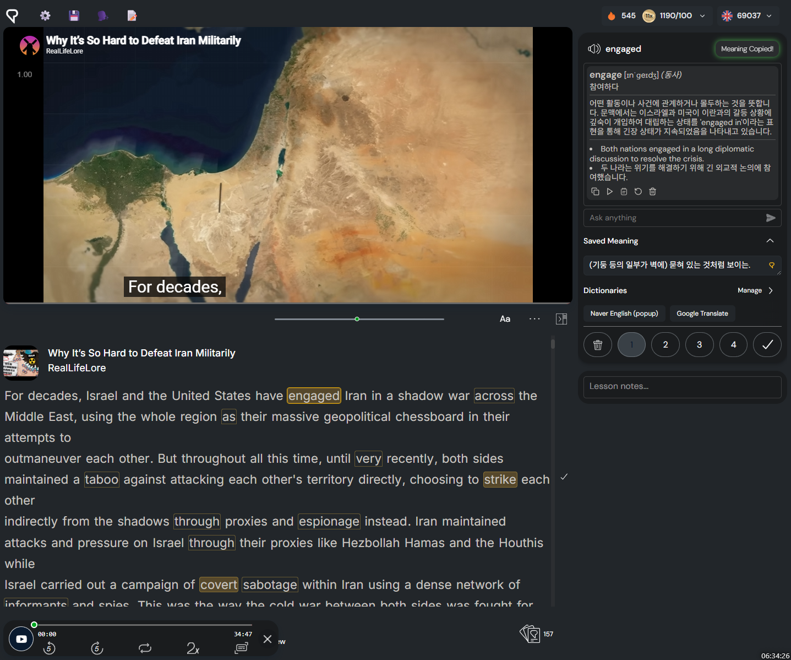
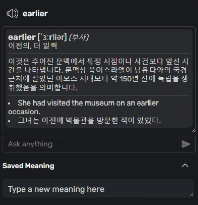
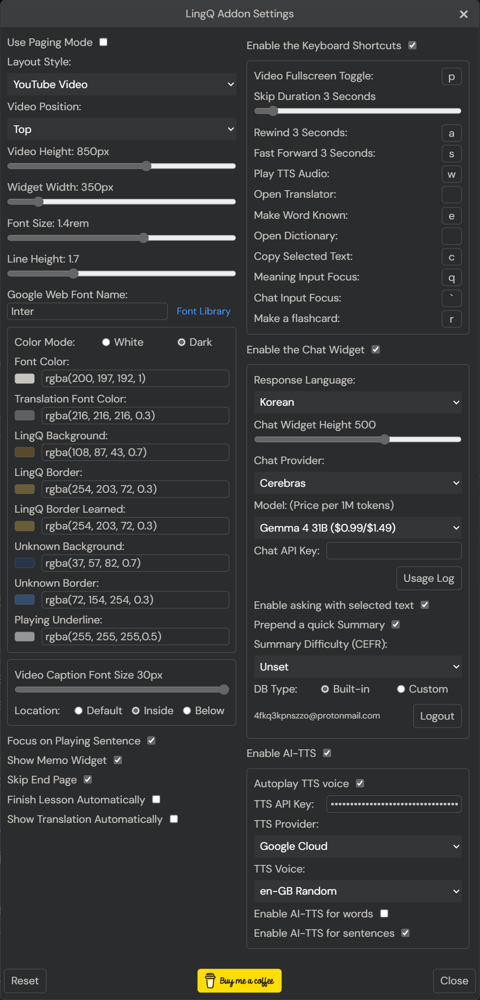
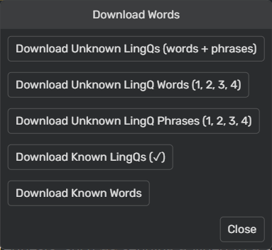
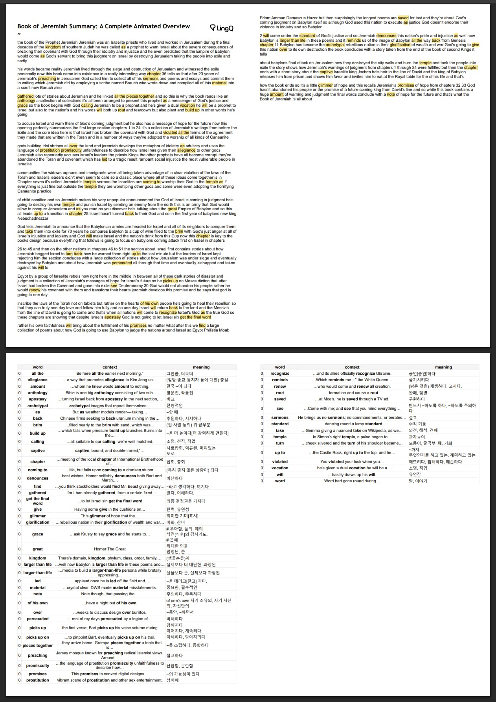
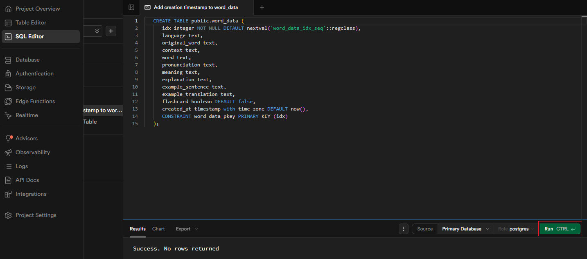
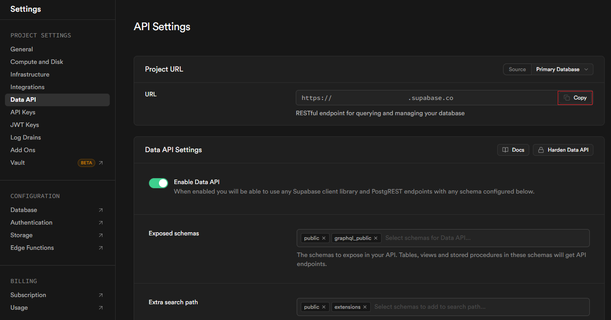
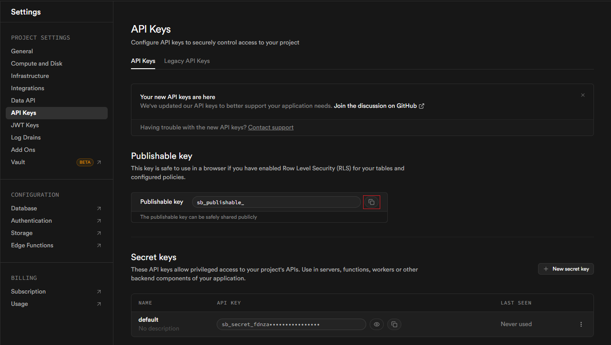

# LingQ Addon

A userscript for Tampermonkey that significantly enhances the LingQ language learning experience. <br>
Customizable layouts, AI-powered chat & TTS, flashcard system, local video player, and more — all in one script.

</br>

## Quick Start

### Desktop

1. Install [Tampermonkey](https://www.tampermonkey.net/) or [GreaseMonkey](https://addons.mozilla.org/en-US/firefox/addon/greasemonkey/).
2. Install the script from the [Project page](https://greasyfork.org/en/scripts/533096-lingq-addon).
3. Visit [LingQ](https://lingq.com/) — the addon activates automatically on reader pages.

### Android

1. Install [Firefox](https://play.google.com/store/apps/details?id=org.mozilla.firefox) and add [Tampermonkey](https://addons.mozilla.org/en-US/android/addon/tampermonkey/).
2. Install the script from the [Project page](https://greasyfork.org/en/scripts/533096-lingq-addon).
3. Visit [LingQ](https://lingq.com/) — refresh the browser if the addon doesn't activate.

> To use AI features (Chat, TTS, Quick Summary), you'll need an API key from one of the [supported providers](#supported-ai-providers).

## Features

-   **Reader Layouts:**
    Preset layouts optimized for video, audio, or text-focused study. Includes a resizable video option.

-   **Local Video Player:**
    Load local video files and sync them with your lesson.

-   **AI Chat Widget:**
    Select a word or sentence, AI generates pronunciation, meaning, and example sentences instantly.

    </br>

-   **Quick Summary:**
    AI-generated lesson summaries with adjustable difficulty.

-   **Flashcard System:**
    Create flashcards from AI responses in a single click. Use either the **built-in local database** or connect your own **Supabase DB** for cloud storage. Export to Anki via CSV.

    </br>

-   **AI TTS:**
    AI-based text-to-speech for words, sentences, and full lesson audio generation.

    </br>

-   **Appearance Customization:**
    Dark/Light themes, custom color palette, adjustable font size and line height, and custom font support.

    </br>

-   **Vocabulary Tools:**
    Download Entire known/unknown words and phrases as CSV.

    </br>

-   **Print a Lesson:**
    Print lessons with word highlighting and vocabulary list.

    </br>

## Supported AI Providers

To use AI features, create an API key from any supported provider and enter it in ⚙️ **Settings**.

| Provider      | API Key Guide |
|---------------|---|
| OpenAI (GPT)  | [Tutorial](https://youtu.be/SzPE_AE0eEo) |
| Google Gemini | [Tutorial](https://youtu.be/6BRyynZkvf0) |
| Google Vertex | — |
| Anthropic     | — |
| DeepSeek      | [Tutorial](https://www.youtube.com/watch?v=CpZFf6JkHgY) |
| Cerebras      | — |

## Setup Guides

<details>
<summary><b>Supabase DB — Cloud Flashcard Storage (Optional)</b></summary>

To store flashcards in the cloud, set up your own Supabase project and connect it with the addon, or just use the built-in DB.

1. **Create a Supabase Project**
   Visit [Supabase](https://supabase.com) and sign up (or log in).
   Click **New Project**, choose a name and region, then wait until the database is ready.

2. **Run the Provided SQL**
   Open your **Project Dashboard > SQL Editor**, and paste the SQL schema below.
   </br>
   ```sql
    CREATE TABLE public.word_data (
        idx SERIAL PRIMARY KEY,
        language text,
        original_word text,
        context text,
        word text,
        pronunciation text,
        meaning text,
        explanation text,
        example_sentence text,
        example_translation text,
        flashcard boolean DEFAULT false,
        created_at timestamptz DEFAULT now()
    );
   ```
   Click **Run** to initialize your database structure.
   You should now see a new table named `word_data` inside your project.

3. **Get the URL and Key**
   Go to **Project Settings > Data API**, and copy the **Project URL**.
   </br>
   Then go to **Project Settings > API keys**, and copy the **Publishable key**.
   </br>

4. **Enter the Keys in the Addon Settings**
   Paste your **Project URL** and **Publishable Key** into the corresponding fields in the ⚙️ **Settings**.

</details>

<details>
<summary><b>Anki Integration — Import Flashcards (Optional)</b></summary>

You can import flashcard CSV exports into Anki using a matching card template.

</br>

1. Download and open the [LingQ Flashcard Deck.apkg](https://github.com/2p990i9hpral/LingQ_Add-On/raw/refs/heads/main/LingQ%20Flashcard%20Deck.apkg) file.
   This will automatically add the "LingQ Flashcard" note type to your Anki collection.
2. In Anki, go to **File -> Import**, and select the exported CSV file.
3. When the Import dialog appears, set the following options:
    - </br>
    - **Allow HTML in fields:** Enabled
    - **Note Type:** `LingQ Flashcard`
    - **Field mapping:** Verify that columns align correctly with each field.

</details>

## License

[MIT License](LICENSE)