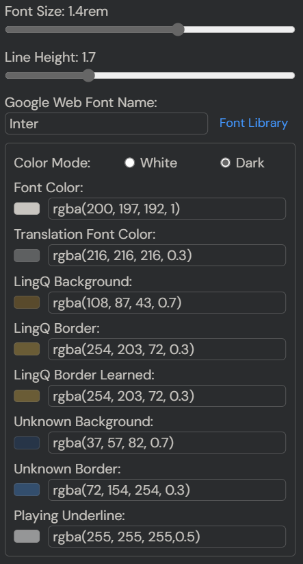

# LingQ Addon

A userscript for Tampermonkey that significantly enhances the LingQ language learning experience.  
Customizable layouts, AI-powered chat & TTS, flashcard system, local video player, and more — all in one script.

 

## Quick Start

### Desktop

1. Install [Tampermonkey](https://www.tampermonkey.net/) or [GreaseMonkey](https://addons.mozilla.org/en-US/firefox/addon/greasemonkey/).
2. Install the script from the [Project page](https://greasyfork.org/en/scripts/533096-lingq-addon).
3. Visit [LingQ](https://lingq.com/) — the addon activates automatically on reader pages.

### Android

1. Install [Firefox](https://play.google.com/store/apps/details?id=org.mozilla.firefox) and add [Tampermonkey](https://addons.mozilla.org/en-US/android/addon/tampermonkey/).
2. Install the script from the [Project page](https://greasyfork.org/en/scripts/533096-lingq-addon).
3. Visit [LingQ](https://lingq.com/) — refresh the browser if the addon doesn't activate.

> To use AI features (Chat, TTS, Quick Summary), you'll need an API key from one of the [supported providers](#supported-ai-providers).

## Features
-   **Reader Layouts:**
    Preset layouts optimized for video, audio, or text-focused study. Includes a resizable video option.

-   **Local Video Player:**
    Load local video files and sync them with your lesson.

-   **AI Chat Widget:**
    Select a word or sentence, AI generates pronunciation, meaning, and example sentences instantly.

     

-   **Quick Summary:**
    AI-generated lesson summaries with adjustable difficulty.

-   **Flashcard System:**
    Create flashcards from AI responses in a single click. Use either the **built-in local database** or connect your own **Supabase DB** for cloud storage. Export to Anki via CSV.

     

-   **AI TTS:**
    AI-based text-to-speech for words, sentences, and full lesson audio generation.

-   **Appearance Customization:**
    Dark/Light themes, custom color palette, adjustable font size and line height, and custom font support.

     

-   **Customizable Keyboard Shortcuts:**
    Streamline your study workflow with fully configurable hotkeys.

     

-   **Vocabulary Tools:**
    Download Entire known/unknown words and phrases as CSV.

     

-   **Print a Lesson:**
    Print lessons with word highlighting and vocabulary list.

     

## Supported AI Providers

To use AI features, create an API key from any supported provider and enter it in ⚙️ **Settings**.

| Provider      | API Key Guide |
|---------------|---|
| OpenAI (GPT)  | [Tutorial](https://youtu.be/SzPE_AE0eEo) |
| Google Gemini | [Tutorial](https://youtu.be/6BRyynZkvf0) |
| Google Vertex | — |
| Anthropic     | — |
| DeepSeek      | [Tutorial](https://www.youtube.com/watch?v=CpZFf6JkHgY) |
| Cerebras      | — |

Recommendation: Google - Gemini 3.1 Flash-Light

## License

[MIT License](LICENSE)