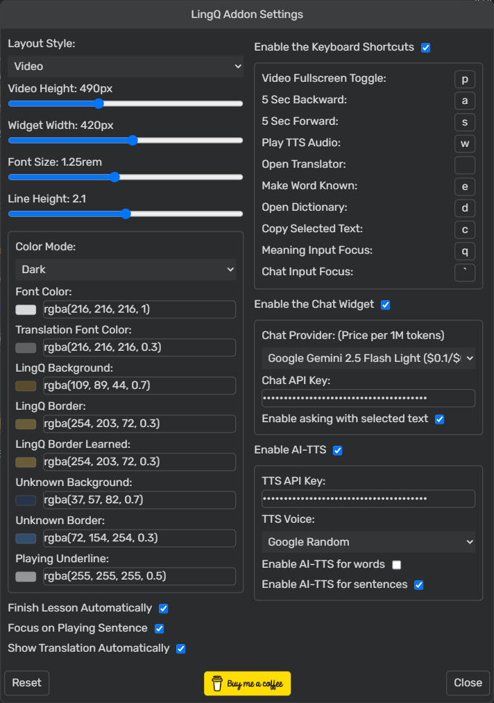

# LingQ Addon

A userscript for Tampermonkey/GreaseMonkey that significantly enhances the LingQ language learning experience.  
It offers customizable layouts, appearance settings, vocabulary downloading tools, an AI-powered chat widget, AI-based TTS, and workflow improvements, all aimed at streamlining your study process.

### Reader Layout
 

### Course Page
 

## Features

*   **Customizable Layouts:**
    *   Video layout:  Displays the video below with the text above.
    *   Video 2 layout: Displays the video on the right side, with the text to the left. Optimized for wide screens.
    *   Audio layout: Optimized for lessons with audio.
    *   Off layout: Disables layout changes and focuses on the sentence mode. Provides a movable, resizable video.
*   **Appearance Customization:**
    *   Adjustable font size and line height for improved readability.
    *   Dark and Light color themes, with customizable color palette, including the background color for known words.
*   **Vocabulary Downloading:**
    *   Download known and unknown words and phrases from the LingQ interface in CSV format.
*   **Workflow Enhancements:**
    *   Keyboard controls for common tasks such as marking words as known, enabling/disabling full screen for video, moving video time, or copying selected vocab.
    *   Optional automatic lesson completion upon audio/video completion.
    *   Improved sentence focus ensures sentence being played is automatically moved to the center of the screen.
    *   Reset course to first position button.
    *   Known words indicator on the library page with percentage detail.
    *   Default course sorting option.
*   **Chat Widget:**
    *   An AI-powered chat widget for interacting with the lesson content.
    *   An AI-based TTS model that substitutes original one.
*   **Enhanced YouTube player**
    *   Turns on caption default.
    *   Disables the player controller.
    *   Adds a video progress indicator synced with the audio player's progress.
    *   Remove the more videos pop-up and youtube logo in the player, so you can read the subtitle while the video is paused.
*   **Print a Lesson with Highlighting and the Vocabulary List**

## Installation

### Desktop

1.  Install a userscript manager like [Tampermonkey](https://www.tampermonkey.net/) or [GreaseMonkey](https://addons.mozilla.org/en-US/firefox/addon/greasemonkey/).
2.  Install the script from [Project page](https://greasyfork.org/en/scripts/533096-lingq-addon).
3.  Visit [LingQ](https://lingq.com/), and the addon features will be active on reader pages.
4.  If you want to use AI features (Chat, TTS), you need to make an API key. Refer to this tutorial video: [Get OpenAI GPT API](https://youtu.be/SzPE_AE0eEo), [Get Google Gemini API](https://youtu.be/6BRyynZkvf0).

### Android

1. Install [Firefox](https://play.google.com/store/apps/details?id=org.mozilla.firefox) app.
2. Install [Tampermonkey](https://addons.mozilla.org/en-US/android/addon/tampermonkey/) within the browser.
3. Install the script from [Project page](https://greasyfork.org/en/scripts/533096-lingq-addon).
4. Visit [LingQ](https://lingq.com/), and the addon features will be active on reader pages. If it doesn't work, refresh the browser. 
5. If you want to use AI features (Chat, TTS), you need to make an API key. Refer to this tutorial video: [Get OpenAI GPT API](https://youtu.be/SzPE_AE0eEo), [Get Google Gemini API](https://youtu.be/6BRyynZkvf0).

## Usage

Once installed, an "⚙️" (settings), "💾" (download words) and a "✔" (complete lesson) will be added to the main navigation bar of LingQ when on a lesson page.

### Settings

 

Click the "⚙️" icon to open the settings popup.  From there, you can adjust:

*   **Layout style**: Select preset reader layouts.
*   **Font Settings**: Adjust font size and line height.
*   **Color Mode**: Select light or dark color mode and customize colors, including font, LingQ background and border, and underlining.
*   **Auto Finishing**: automatically complete the lesson after finishing
*   **Keyboard Shortcuts**: Assign new shortcuts for actions.
*   **Chat widget**: Select LLM Model.
*   **AI-TTS**: Select TTS voice.

### Chat Widget (Word / Sentence)

 

 

The add-on provides a chat widget that uses AI to enhance your learning experience:

*   **Access:** The chat widget can be enabled/disabled in the settings popup.
*   **Models:**  Choose from various language models (LLMs) in the settings.
*   **Input**: There is an Ask Selected option to ask using the selected text automatically or for the model to follow free form text input.
*   **Output:** The chat widget can provide structured and informative output like definitions, translations, and explanations.

### Downloading Words

 

Click the "💾" icon to export LingQs, after clicking a popup will open.  Use the buttons to download the following:

*   **Download Unknown LingQs:** Exports LingQs (words + phrases) with statuses 1, 2, 3, and 4 as a CSV file.
*   **Download Unknown LingQ Words:** Exports words with status 1, 2, 3, and 4
*   **Download Unknown LingQ Phrases:** Exports phrases with status 1, 2, 3, and 4
*   **Download Known LingQs:** Exports known LingQs (words + phrases) as a CSV file.
*   **Download Known Words:** Exports known words as a CSV file.

### Completing Lesson

Click the "✔" icon to complete the lesson.

### Reset Course Position

 

Library courses will have an option to reset lessons to their first position.

### Known Words Indicator

 

Library Lessons are enhanced with an indicator for known words.

### Print a Lesson with Highlighting and the Vocabulary List

 

## Contributing

Feel free to contribute to the project by submitting pull requests or opening issues to report bugs or suggest new features.

## License

[MIT License](LICENSE)