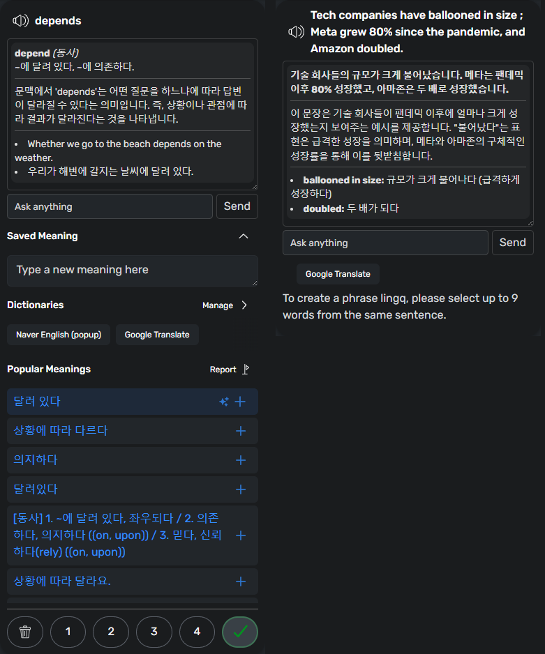

# LingQ Addon

A userscript for Tampermonkey/GreaseMonkey that significantly enhances the LingQ language learning experience. <br>
It offers customizable layouts, appearance settings, vocabulary downloading tools, an AI-powered chat widget, AI-based TTS, and workflow improvements, all aimed at streamlining your study process.

### Reader Layout
</br>

### Course Page
</br>

## Features

-   **Customizable Layouts:**
    -   Video layout:  Displays the video below with the text above.
    -   Video 2 layout: Displays the video on the right side, with the text to the left. Optimized for wide screens.
    -   Audio layout: Optimized for lessons with audio.
    -   Off layout: Disables layout changes and focuses on the sentence mode. Provides a movable, resizable video.
-   **Appearance Customization:**
    -   Adjustable font size and line height for improved readability.
    -   Dark and Light color themes, with customizable color palette, including the background color for known words.
-   **Vocabulary Downloading:**
    -   Download known and unknown words and phrases from the LingQ interface in CSV format.
-   **Workflow Enhancements:**
    -   Keyboard controls for common tasks such as marking words as known, enabling/disabling full screen for video, moving video time, or copying selected vocab.
    -   Optional automatic lesson completion upon audio/video completion.
    -   Improved sentence focus ensures sentence being played is automatically moved to the center of the screen.
    -   Reset course to first position button.
    -   Known words indicator on the library page with percentage detail.
    -   Default course sorting option.
-   **Chat Widget:**
    -   An AI-powered chat widget for interacting with the lesson content.
    -   An AI-powered flashcard generation.
    -   An AI-based TTS model that substitutes original one.
-   **Flashcard Management:**
    -   Create flashcards with a single click based on AI response.   
- **Enhanced YouTube player**
    -   Turns on caption default.
    -   Disables the player controller.
    -   Adds a video progress indicator synced with the audio player's progress.
    -   Remove the more videos pop-up and youtube logo in the player, so you can read the subtitle while the video is paused.
-   **Print a Lesson with Highlighting and the Vocabulary List**
-   **Generate a Lesson Audio with AI-based TTS**

## Installation

### Desktop

1.  Install a userscript manager like [Tampermonkey](https://www.tampermonkey.net/) or [GreaseMonkey](https://addons.mozilla.org/en-US/firefox/addon/greasemonkey/).
2.  Install the script from [Project page](https://greasyfork.org/en/scripts/533096-lingq-addon).
3.  Visit [LingQ](https://lingq.com/), and the addon features will be active on reader pages.
4.  If you want to use AI features (Chat, TTS), you need to make an API key. Refer to this tutorial video: [Get OpenAI GPT API](https://youtu.be/SzPE_AE0eEo), [Get Google Gemini API](https://youtu.be/6BRyynZkvf0).

### Android

1. Install [Firefox](https://play.google.com/store/apps/details?id=org.mozilla.firefox) app.
2. Install [Tampermonkey](https://addons.mozilla.org/en-US/android/addon/tampermonkey/) within the browser.
3. Install the script from [Project page](https://greasyfork.org/en/scripts/533096-lingq-addon).
4. Visit [LingQ](https://lingq.com/), and the addon features will be active on reader pages. If it doesn't work, refresh the browser. 
5. If you want to use AI features (Chat, TTS), you need to make an API key. Refer to this tutorial video: [Get OpenAI GPT API](https://youtu.be/SzPE_AE0eEo), [Get Google Gemini API](https://youtu.be/6BRyynZkvf0).

### Supabase DB (Optional)

To enable the flashcard feature, you need to create your own Supabase project and connect it with the add-on.

1. **Create a Supabase Project**  
   Visit [Supabase](https://supabase.com) and sign up (or log in).  
   Click **New Project**, choose a name and region, then wait until the database is ready.

2. **Run the Provided SQL**  
   Open your **Project Dashboard > SQL Editor**, and paste the provided SQL schema (from this repository).  
   </br>
   ```sql
    CREATE TABLE public.word_data (
        idx SERIAL PRIMARY KEY,
        language text,
        original_word text,
        context text,
        word text,
        pronunciation text,
        meaning text,
        explanation text,
        example_sentence text,
        example_translation text,
        flashcard boolean DEFAULT false,
        created_at timestamptz DEFAULT now()
    );
   ```
   Click **Run** to initialize your database structure. 
   You should now see a new table named `word_data` inside your project.

3. **Get the URL and Key**  
   Go to **Project Settings > Data API**, and copy the **Project URL**.  
   </br>
   Then go to **Project Settings > API keys**, and copy the **Publishable key**.
   </br>  

4. **Enter the Keys in the Add-on Settings**  
   Paste your **Project URL** and **Publishable Key** into the corresponding fields in the LingQ Addon’s ⚙️ **Settings**.  
   After saving, you can make flashcards from AI-generated word explanation in a single click.

## Usage

Once installed, an "⚙️" (settings), "💾" (download words) and a "✔" (complete lesson) will be added to the main navigation bar of LingQ when on a lesson page.

### Settings

</br>

Click the "⚙️" icon to open the settings popup.  From there, you can adjust:

-   **Layout style**: Select preset reader layouts.
-   **Color Mode**: Select light or dark color mode and customize colors, including font, LingQ background and border, and underlining.
-   **Keyboard Shortcuts**: Assign new shortcuts for actions.
-   **Chat widget**: Select LLM Model.
-   **AI-TTS**: Select TTS voice.

### Chat Widget (Word / Sentence)

</br>
</br>

The add-on includes an AI-powered **chat widget** designed to enhance your learning experience.  
It analyzes the selected text, provides detailed explanations, and lets you interact with the results through convenient tools.

-   **Display:** When you select a word or sentence, the AI automatically generates an analysis containing pronunciation, meaning, and example sentences.
-   **Flashcard View:** Clicking on the **word title** opens your saved flashcards for that word, allowing you to easily review existing ones.
-   **Quick Copy:** Clicking on a **meaning** or **example sentence** copies it directly to your clipboard.
-   **Action Buttons:**
    -   **Copy** – Copy the entire generated content (definition + examples).
    -   **Read with TTS** – Play the pronunciation using the AI-based voice.
    -   **Make a Flashcard** – Save the current word and explanation to your Supabase database.
    -   **Regenerate** – Re-run the AI request to generate a new explanation or alternative examples.

### Downloading Words

</br>

Click the "💾" icon to export LingQs, after clicking a popup will open.  Use the buttons to download the following:

-   **Download Unknown LingQs:** Exports LingQs (words + phrases) with statuses 1, 2, 3, and 4 as a CSV file.
-   **Download Unknown LingQ Words:** Exports words with status 1, 2, 3, and 4
-   **Download Unknown LingQ Phrases:** Exports phrases with status 1, 2, 3, and 4
-   **Download Known LingQs:** Exports known LingQs (words + phrases) as a CSV file.
-   **Download Known Words:** Exports known words as a CSV file.

### Reset Course Position

</br>

Library courses will have an option to reset lessons to their first position.

### Known Words Indicator

</br>

Library Lessons are enhanced with an indicator for known words.

### Print a Lesson with Highlighting and the Vocabulary List

</br>

### Generate a Lesson Audio with AI-based TTS

</br>

### Flashcard Manager

</br>

Click the "📝" button to open the Flashcard Manager.  
Here, you can view, edit, and manage all flashcards stored.

</br>

You can import the CSV into Anki using a matching card template.  
Follow the steps below to install and use the Anki template:

1. Download and open the provided [LingQ Flashcard Deck.apkg](https://github.com/2p990i9hpral/LingQ_Add-On/raw/refs/heads/main/LingQ%20Flashcard%20Deck.apkg) file.  
   This will automatically add the "LingQ Flashcard" note type to your Anki collection.
2. In Anki, go to **File -> Import**, and select the exported CSV file.
3. When the Import dialog appears, set the following options:
    - </br>
    - **Allow HTML in fields:** Enabled
    - **Note Type:** `LingQ Flashcard`
    - **Field mapping:** Verify that columns align correctly with each field .


## License

[MIT License](LICENSE)